# Ukraine Grid and Sector Visualization with PostGIS and Python

This project demonstrates how to visualize Ukraine’s borders, build geospatial grids, and generate directional sectors using Python (Folium, GeoPandas, Shapely) and PostgreSQL with PostGIS.  
It was completed as a test project for Vodafone to showcase geospatial database design, geometry handling, and map visualization.

---

## 📘 Database Schema

```sql
ukraine_borders(id SERIAL, region TEXT, geom GEOMETRY(Point,4326))
ukraine_grid_points(id SERIAL, geom GEOMETRY(Point,4326))
ukraine_grid_sectors(id SERIAL, point_id INT, azimuth INT, sector GEOMETRY(Polygon,4326))
grid_point_sector_intersections(id SERIAL, point_id INT, sector_id INT)
```

---

## 🧩 Libraries Used

- **psycopg2** — PostgreSQL driver for executing SQL queries.  
- **folium** — Interactive map visualization (Leaflet.js).  
- **geopandas** — Extension of Pandas for spatial data.  
- **shapely** — Geometric operations for polygons and points.  
- **math** — Used for trigonometric calculations (sin/cos).  
- **IPython.display** — To show HTML maps in Jupyter Notebook.

---

## 🗺️ Tasks 1–2: Loading and Visualizing Ukraine’s Border

**Goal:** Import Ukraine’s border coordinates into PostgreSQL and visualize them in Python or via Leaflet.

**Steps:**  
1. Download coordinates as text files:
   - `coord_border_ukraine.txt` — national border  
   - `ua_regions_full.txt` — regional borders with `#Region` markers  
2. Load into PostgreSQL with PostGIS geometry type `GEOMETRY(Point,4326)` (EPSG:4326 = WGS84).

```python
cur.execute("""
    INSERT INTO ukraine_borders (region, geom)
    VALUES (%s, ST_SetSRID(ST_MakePoint(%s, %s), 4326));
""", ("Ukraine", longitude, latitude))
```

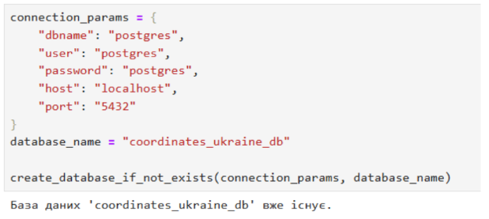  
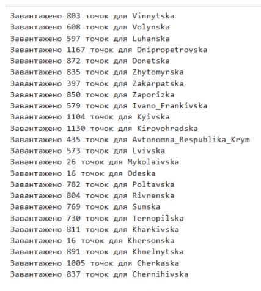

**Visualization in Folium:**

```sql
SELECT ST_X(geom), ST_Y(geom)
FROM ukraine_borders
WHERE region = 'Ukraine';
```

The average coordinate is used to center the map.  
Results are saved as `map_ukraine.html`.

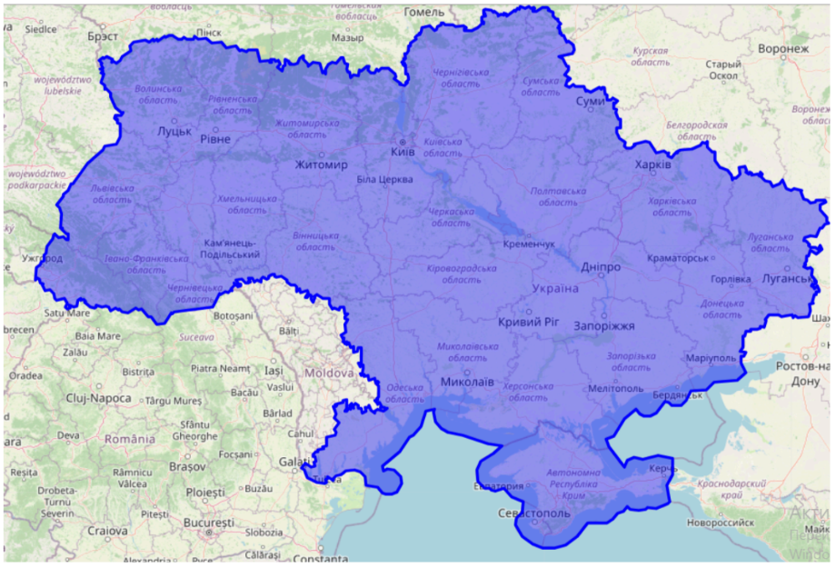  
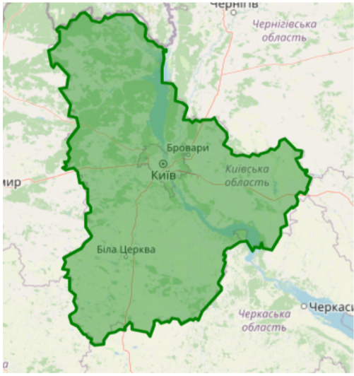

---

## 🧮 Tasks 3–5: Grid Generation

**Goal:** Split Ukraine’s area into equal grid squares (~1 km or 10 km side length).  
Store grid vertices in the database and display them on a map.

**Algorithm Overview:**
- Define bounding box of Ukraine using min/max coordinates.  
- Create square cells using `ST_MakeEnvelope()` and `generate_series()`.  
- Intersect or clip the grid with the country polygon.

**Example SQL:**

```sql
WITH poly AS (
  SELECT ST_MakePolygon(ST_MakeLine(geom ORDER BY id))::geometry(Polygon,4326) AS geom
  FROM ukraine_borders
  WHERE region = 'Ukraine'
),
ua AS (
  SELECT ST_Transform(geom, 32636) AS g FROM poly
),
bounds AS (
  SELECT ST_XMin(g) AS minx, ST_YMin(g) AS miny, ST_XMax(g) AS maxx, ST_YMax(g) AS maxy
  FROM ua
),
grid AS (
  SELECT ST_MakeEnvelope(x, y, x+10000, y+10000, 32636) AS cell
  FROM bounds,
       generate_series((SELECT minx FROM bounds)::bigint, (SELECT maxx FROM bounds)::bigint, 10000) AS x,
       generate_series((SELECT miny FROM bounds)::bigint, (SELECT maxy FROM bounds)::bigint, 10000) AS y
)
SELECT ST_AsEWKB(cell) FROM grid;
```

**Two display strategies:**

- **Clipped to country border (precise but partial cells at the boundary):**  
  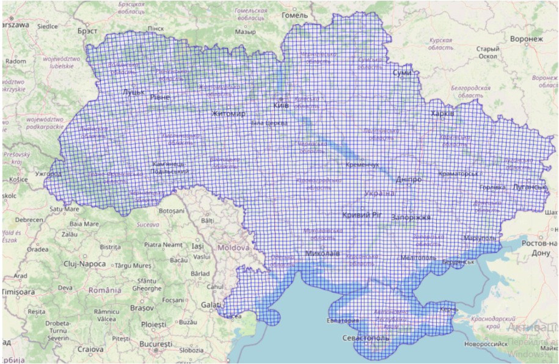  
  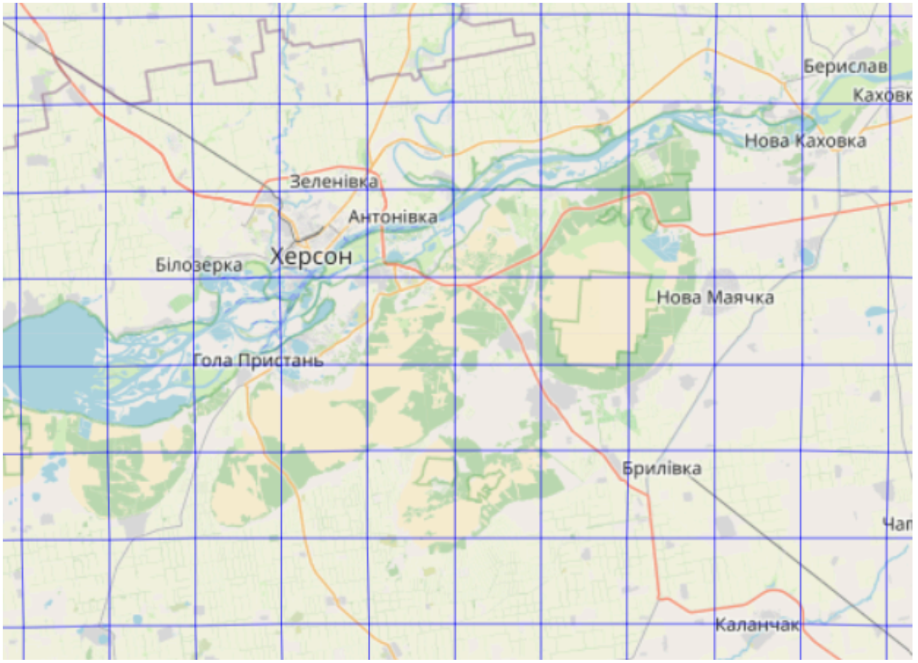

- **Whole cells intersecting the border (may extend outside):**  
  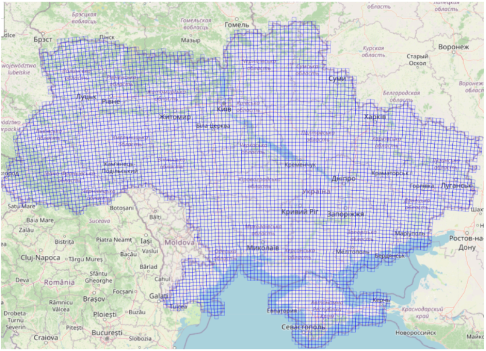  
  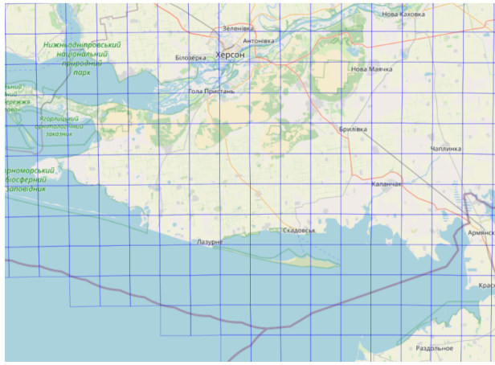

**Kyiv Region – 1×1 km grid**  
(uses the same approach with cell size 1000 m):
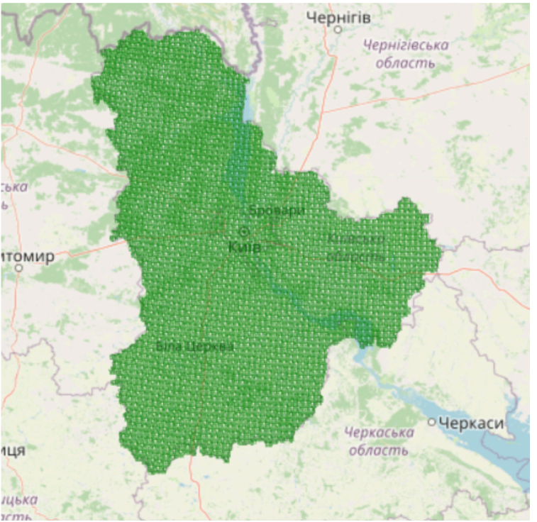  
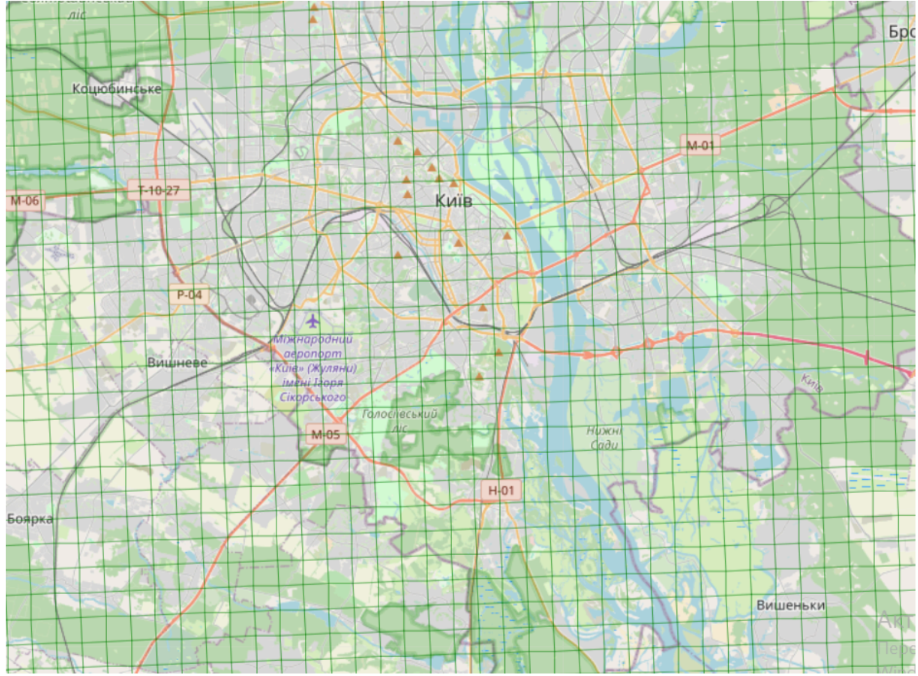

**Saving unique grid vertices** (dedupe shared corners):
```sql
WITH pts AS (
  SELECT (dp).geom AS p FROM grid, LATERAL ST_DumpPoints(cell) AS dp
),
uniq AS (
  SELECT DISTINCT ST_AsEWKB(p) AS p_wkb FROM pts
)
-- Insert uniq points into ukraine_grid_points
```

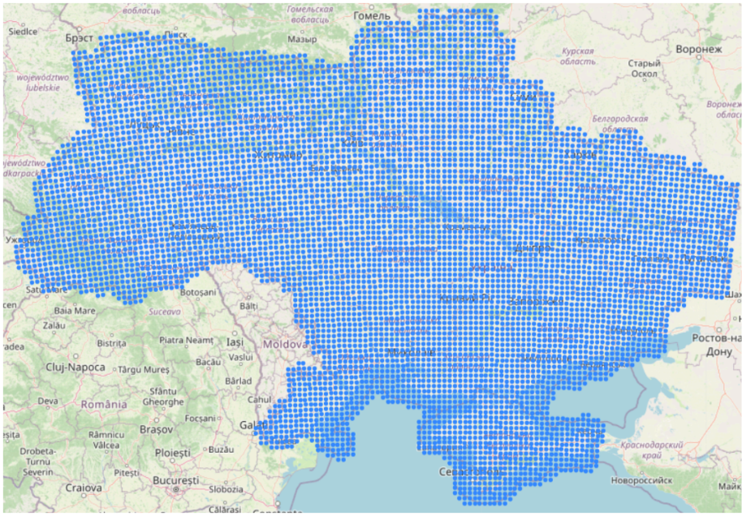  
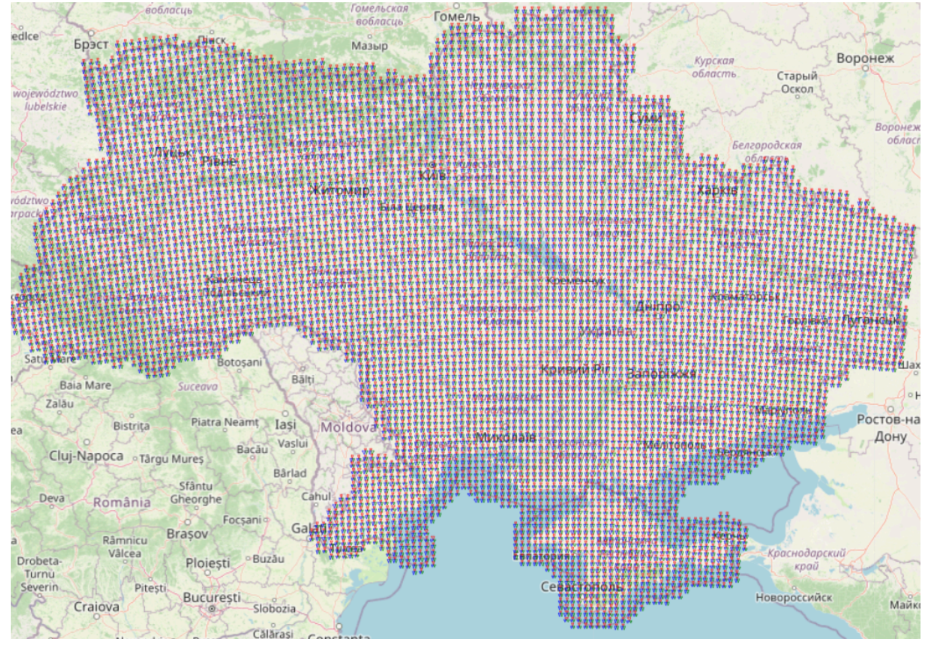

---

## 🧭 Tasks 6–7: Sector Generation and Intersections

**Goal:** From each vertex, draw 3 directional sectors (azimuths 0°, 120°, 240°) with 60° spread and 5 km radius.  
Save intersections between sectors and grid vertices in the database.

```python
def build_sector(point, azimuth_deg, spread=60, radius=5000, n=30):
    # Builds a circular sector polygon from a given point
    angles = [azimuth_deg - spread/2 + i*(spread/n) for i in range(n+1)]
    arc_points = []
    lon, lat = point.x, point.y
    for ang in angles:
        ang_rad = math.radians(ang)
        dx = radius * math.sin(ang_rad)
        dy = radius * math.cos(ang_rad)
        arc_points.append((lon + dx/111320, lat + dy/111320))
    return Polygon([point.coords[0]] + arc_points + [point.coords[0]])
```

```sql
CREATE TABLE ukraine_grid_sectors (
    id SERIAL PRIMARY KEY,
    point_id INT,
    azimuth INT,
    sector geometry(Polygon,4326)
);
```

**Intersection Detection:**

```sql
SELECT p.id AS point_id, s.id AS sector_id
FROM ukraine_grid_points p
JOIN ukraine_grid_sectors s
  ON ST_Contains(s.sector, p.geom);
```

**Visualizations:**  
- No grid overlay (sectors only):  
    
  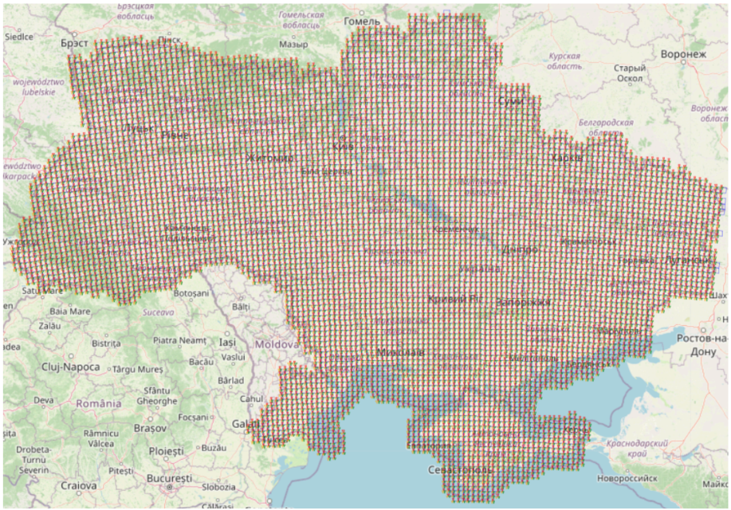

- With grid overlay:  
  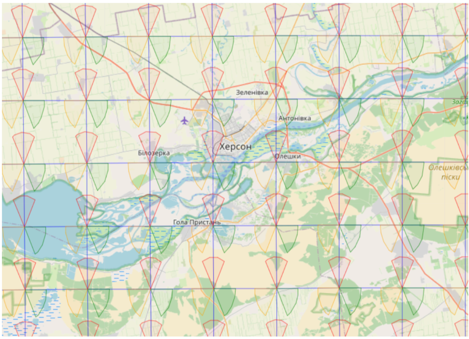  
  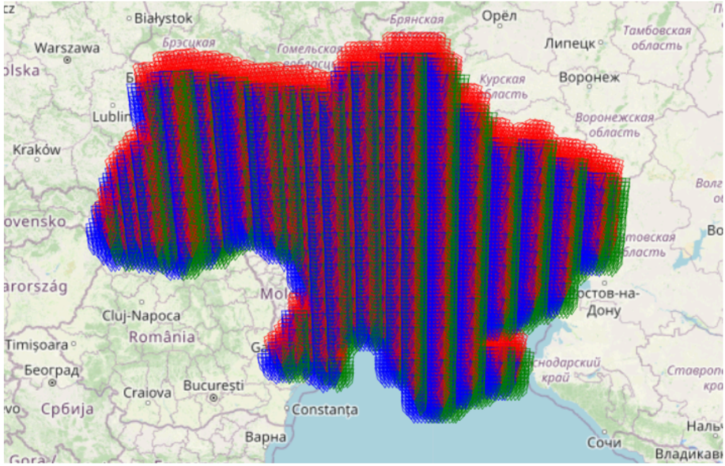

- Larger sectors for demonstration (`radius=50000`):  
  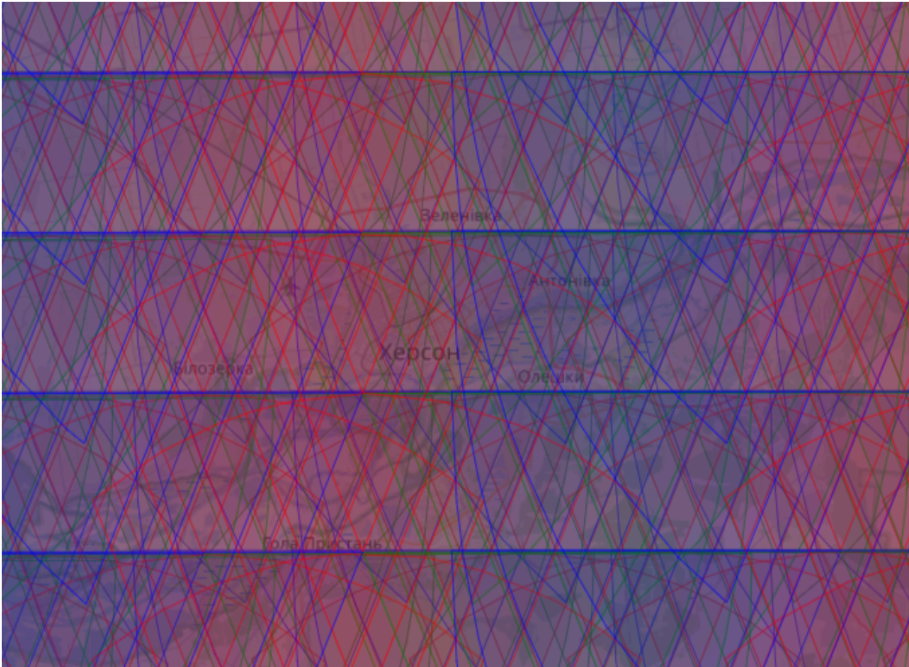  
  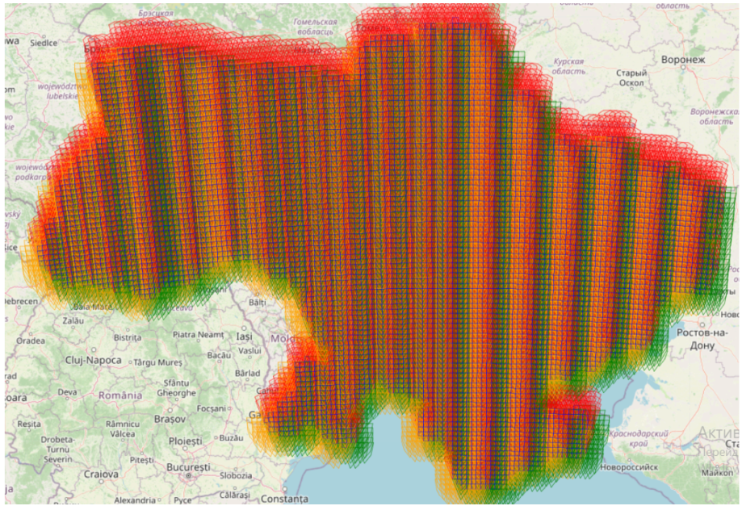  
  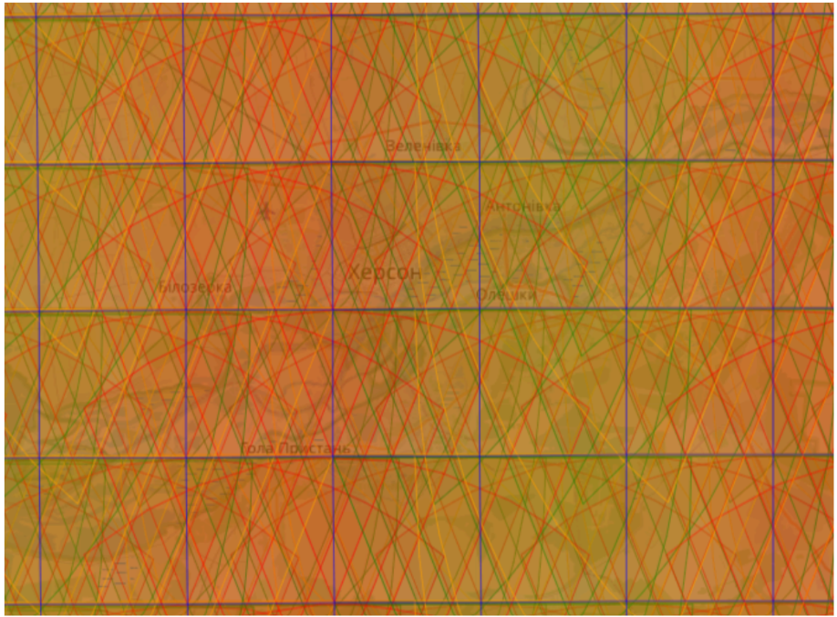

---

## 🗂️ Output Files

| File | Description |
|------|--------------|
| `map_ukraine.html` | Border map of Ukraine |
| `map_kyivska.html` | Kyiv region visualization |
| `map_ukraine_grid_points.html` | Grid vertices map |
| `map_grid_with_sectors.html` | Full sector overlay map |

---

## 🧠 Technologies

| Category | Tools |
|-----------|--------|
| Database | PostgreSQL, PostGIS |
| Visualization | Folium (Leaflet.js), GeoPandas |
| Geometry | Shapely |
| Scripting | Python 3.12 |
| Data Storage | WKB/WKT geometry serialization |

---

## 📷 Image Manifest (19 items)

| # | Filename | Suggested Caption |
|---|----------|-------------------|
| 1 | image/figure1.PNG | Database creation example |
| 2 | image/figure2.PNG | Insert region points |
| 3 | image/figure3.PNG | Ukraine border (national) |
| 4 | image/figure4.PNG | Kyiv region polygon |
| 5 | image/figure5.PNG | Grid clipped to border (overview) |
| 6 | image/figure6.PNG | Grid clipped to border (zoom) |
| 7 | image/figure7.PNG | Whole-intersecting cells (overview) |
| 8 | image/figure8.PNG | Whole-intersecting cells (zoom) |
| 9 | image/figure9.PNG | Kyiv 1×1 km grid (overview) |
| 10 | image/figure10.PNG | Kyiv 1×1 km grid (zoom) |
| 11 | image/figure11.PNG | Console insertion log |
| 12 | image/figure12.PNG | Unique vertices map |
| 13 | image/figure13.PNG | Sectors without grid (overview) |
| 14 | image/figure14.PNG | Sectors without grid (zoom) |
| 15 | image/figure15.PNG | Sectors with grid (overview) |
| 16 | image/figure16.PNG | Sectors with grid (zoom) |
| 17 | image/figure17.PNG | 50 km sectors (no grid) |
| 18 | image/figure18.PNG | 50 km sectors (zoom) |
| 19 | image/figure19.PNG | 50 km sectors with grid |

---

© 2025 — Prepared by **Angelina Ivanova** as a demonstration of GIS and database integration for geospatial visualization.
